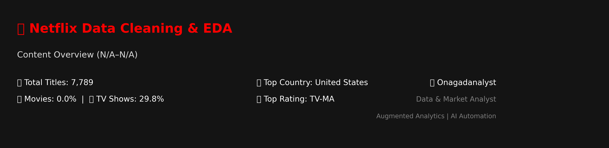

---

🎬 Netflix Data Cleaning & Exploratory Data Analysis (EDA)

🧠 Project Overview

This project focuses on cleaning and exploring a **Netflix dataset** containing details about movies and TV shows available on the platform.
The goal is to understand trends in Netflix’s catalog — such as **content types, release patterns, country contributions, and popular directors** — while ensuring the data is clean and analysis-ready.

---

🎯 Objectives

. Clean and prepare the dataset for analysis.
. Identify and handle duplicates and missing values.
. Convert data types (e.g., dates) for consistency.
. Explore key business questions through EDA.

---

🧰 Tools & Libraries

1. Python (Jupyter Notebook)
2. Libraries: `pandas`, `matplotlib`, `seaborn`, `numpy`

---

🧹 Data Cleaning Process

Steps performed to prepare the dataset:

1. Removed duplicate records to maintain data integrity.
2. Identified and summarized missing values.
3. Converted the `Release_Date` column to standard `datetime` format.
4. Dropped irrelevant columns and standardized categorical values.
5. Verified data types and ensured overall dataset consistency.

---

📊 Exploratory Data Analysis

Key exploratory queries and findings:

. Content Type Distribution: Number of Movies vs TV Shows on Netflix.
. Release Trends: Year-wise release frequency — shows Netflix’s expansion.
. Regional Analysis: Titles produced or released in 'India' and the 'UK'.
. Top Directors: Identified the most prolific Netflix contributors.
. Actor Spotlight: Movies featuring 'Tom Cruise'.
. Genre & Rating Patterns: Distribution of categories and rating types.

Example visuals from the notebook include:

. Bar charts for 'content distribution and release years'.
. Countplots showing 'category breakdowns' using Seaborn.

---

 📈 Key Insights

. Movies make up the majority of Netflix’s catalog, though **TV Shows** are growing steadily.
. The 'early 2020s' show a spike in global releases.
. 'India' and the **UK** remain strong contributors of Netflix Originals.
. 'Top directors' have produced a significant portion of Netflix’s total content.
. The dataset reveals diverse 'rating systems' across countries.

---

 📂 Repository Structure

```
📁 Netflix-EDA-Project/
│
├── NetflixSC.ipynb              # Main Jupyter Notebook
├── data/
│   └── Netflixd.csv             # Dataset file (optional upload)
├── visuals/
│   └── readme_banner.PNG       # Example chart or screenshot
└── README.md                    # Project documentation
```

---

🧠 Skills Demonstrated

. Data Cleaning (duplicates, missing data, data type conversions)
. Exploratory Data Analysis (EDA)
. Data Visualization using Matplotlib & Seaborn
. Python and Jupyter Notebook workflow
. Analytical storytelling and business insight derivation

---

📬 Contact

Name: Onagadanalyst
Role: Data & Market Analyst | Building Expertise in Augmented Analytics and AI Automation
LinkedIn: 
GitHub: https://github.com/o-danalyst

---

---

